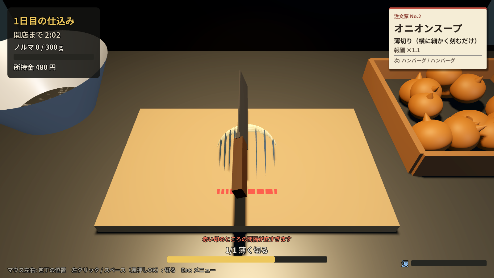

# 涙のみじん切り / Onion Tears（仮題）

洋食屋の仕込み場で、自分のペースでひたすら玉ねぎをみじん切りにする、スローライフ寄りの
3D シミュレーションゲームです。時間制限やノルマはなく、切りたいだけ切って、
気が済んだら「今日はここまで」で終われます。
切るほど目がしみて視界がにじむ「涙」がこのゲームの売りです。
稼いだお金で包丁やゴーグル、フードプロセッサーを買って、仕込みを効率化・自動化していきます。
訳あってこの町に流れ着いた、多くを語らない主人公の小さな日記も、日を追うごとに顔を出します。
最終目標は **Steam での販売** です。





## 遊び方

| 操作 | 内容 |
| --- | --- |
| マウス左右 | 包丁の位置を動かす |
| 左クリック / スペース | 包丁を下ろす（みじん切り工程は長押しでトントン連打） |
| Esc | 一時停止メニュー |

時間制限もノルマもありません。右上の**注文票**に書かれた料理に合わせて、
自分のペースで半分に切った玉ねぎを仕上げていきます。基本（みじん切り）は3つの工程です。

1. **縦に切り込み**：まな板の手前に赤い印が出ている間は、切れ目の間隔が広すぎます。印が消えるまで切る。
2. **横に刻む**：玉ねぎが90°回るので、同じように刻むとサイコロ状になる。
3. **トントン細かく**：かき集めた山に包丁を連打して、かけらを細かくする。9割が十分細かくなったら完成。

- 注文は日を追うごとに増えます（切った個数ぶん「日」が進みます）。切り方によって工程と細かさ、報酬が変わります。

| 注文 | 切り方 | 出てくる日 | 報酬 |
| --- | --- | --- | --- |
| ハンバーグ | みじん切り | 1日目〜 | ×1.0 |
| カレー | 粗みじん（大きめでOK、工程が早く終わる） | 2日目〜 | ×0.8 |
| オニオンスープ | 薄切り（横に細かく刻むだけ、間隔がとても狭い） | 3日目〜 | ×1.1 |
| ドレッシング | 極みじん（とても細かく） | 4日目〜 | ×1.6 |

- できたものはボウルへ。グラム数と注文の倍率に応じて報酬が入ります。
- 切りたいだけ切ったら「今日はここまで」ボタンでいつでも終業。強制的に終わらされることはありません。
- **涙ゲージ**：切るたびにたまり、画面がにじみます。満タンになると数秒間、目が開けられず切れません。
  （急かす要素ではなく、自然とペース配分したくなる仕掛けです）
- 仕込み終了後の「厨房道具屋」で強化を買えます。
  - **よく切れる包丁**：みじん切りで一度に刻める幅が広がる
  - **玉ねぎゴーグル**：涙がたまりにくくなる
  - **フードプロセッサー**：一定時間ごとに自動で100g刻む
  - **仕入れ先と値段交渉**：100gあたりの報酬アップ
- 決まった日（1・2・3・5・7・10日目…）の仕込み終了後には、主人公の短い**日記**が出てきます。
  多くは語らない性格なので、断片的にぽつりぽつりと。
- 進行は自動保存されます。日本語 / 英語をタイトル画面で切り替えられます。
- 音と BGM のオン / オフは一時停止メニュー（Esc）から切り替えられます。
- BGM はメニューを開いている間はこもって聞こえます。

## 開発環境の準備

1. [Godot 4.4 以降（Standard版）](https://godotengine.org/download) をダウンロード（無料・インストール不要）
2. Godot を起動 →「インポート」→ このフォルダの `project.godot` を選択
3. F5 で実行

## フォルダ構成

```
project.godot            プロジェクト設定（メインシーン、オートロード、フォント）
scenes/main.tscn         メインシーン（中身は main.gd がコードで組み立てる）
scripts/
  main.gd                仕込み場の3D空間・仕込みループ・包丁・涙・フードプロセッサー
  onion.gd               刻まれる玉ねぎ（切れ目の管理、ブロックのメッシュ生成、みじん切りの山）
  game_state.gd          セーブ/ロード、お金、アップグレード、バランス調整の数式
  ui.gd                  HUD・タイトル・仕込み終了画面＋道具屋・一時停止
  i18n.gd                日本語/英語のテキスト表
  sfx.gd                 効果音（起動時にプログラムで合成）と BGM の再生
  dev_screenshot.gd      開発用：コマンドラインでスクリーンショットを撮る
audio/bgm_bistro.wav     BGM（tools/make_bgm.py で合成したもの）
tools/
  make_bgm.py            BGM を合成して audio/bgm_bistro.wav を作る（Python 3 だけで動く）
  export_sfx.gd          開発用：効果音を WAV に書き出す
  selftest.gd            開発用：全種類の注文が最後まで切れるかの自動テスト
shaders/
  onion.gdshader         切り口に玉ねぎの層（同心円）が見えるシェーダー
  tears.gdshader         涙で画面がゆらゆらにじむ効果
fonts/                   Noto Sans JP（SIL OFL ライセンス。Steam 販売でも同梱可）
docs/STEAM_ROADMAP.md    Steam 販売までの道のり
docs/sfx_preview.wav     効果音の試聴用（ザクッ→コツ→シュッ→トントン…→チャリン→ぽとっ→ずびっ→ウィーン→チーン）
docs/voice_preview.wav   「うぅ…」の声の試聴用（ずびっ→うぅ…）
```

### 切るしくみ

- 半分の玉ねぎは「半楕円体」。切れ目の位置を X（縦）と Z（横）のリストで持ち、
  切れ目で区切られたブロックごとにメッシュを組み立て直しています。
- シェーダーには切る前の座標を渡していて、切り口に層の輪が正しく現れます。
- みじん切り工程では、ブロックを小さな立方体（MultiMesh）に置き換え、
  包丁が当たったかけらを 2 つに割っていきます。

### 効果音

音はすべて `scripts/sfx.gd` で、ノイズやサイン波を組み合わせて合成しています。
素材ファイルを使っていないのでライセンスの心配がなく、数値を変えるだけで音を調整できます。

| 名前 | 鳴る場面 |
| --- | --- |
| cut | 工程1・2で玉ねぎを切る（ザクッ） |
| mince | みじん切り（トン） |
| knock | 何も切れずにまな板を叩いた・玉ねぎが置かれた（コツ） |
| whoosh | 玉ねぎを回す・かき集める（シュッ） |
| coin / plop | 1個完成して報酬（チャリン）、ボウルに入る（ぽとっ） |
| sniff / voice | 涙が限界（ずびっ、に続けて「うぅ…」という声） |
| bell | 仕込み開始・終了（チーン） |
| processor / ambience | フードプロセッサーの回転音、厨房の環境音（ループ） |

`voice`（「うぅ…」の声）だけは録音を使わず、倍音をヒトの声の母音（フォルマント）の
周波数の山の形に重ねる「加算合成」で作っています。ピッチを下げながら「う」寄りから
少し開いた響きへ変化させ、ため息のような脱力感を出しています。

書き出して試聴するには:

```sh
godot --headless --path . -s tools/export_sfx.gd -- --out=/tmp/sfx
```

あとで本物の録音素材に差し替えるときは、`Sfx.play("cut")` などの呼び出しはそのままで、
`sfx.gd` の `_streams["cut"]` に読み込んだ音声を入れれば置き換えられます。

### BGM

`tools/make_bgm.py` が、76 BPM・16小節（約50秒）のカフェ風ループを合成します。
ロデス風の電子ピアノ（トレモロつき）のコードと同じ音色のやわらかいメロディ、
丸いウッドベース、2・4拍だけのブラシスネアという、打楽器を絞った落ち着いた編成です。
メロディやコード進行はスクリプト内の `MELODY` / `CHORDS` を書き換えて、

```sh
python3 tools/make_bgm.py
```

を実行すれば作り直せます。

### 注文

注文の種類は `scripts/game_state.gd` の `ORDERS` にまとまっています。
工程（L=縦に切り込み / C=横に刻む / M=トントン細かく）、切れ目の間隔の上限、
みじん切りの目標サイズ、報酬の倍率、出てくる日を1行ずつ書き足せば新しい注文を増やせます
（名前と説明の文言は `scripts/i18n.gd` に追加）。

### 主人公の日記

`scripts/main.gd` 冒頭の `DIARY_DAYS`（日記が出てくる日のリスト）と、
`scripts/i18n.gd` の `DIARY_<日数>`（本文、日本語・英語）で管理しています。
日を増やしたいときは `DIARY_DAYS` に日数を足し、`i18n.gd` に対応する `DIARY_<日数>` を追加するだけです。
セーブデータに「見た/見ていない」は持たせておらず、その日の仕込みを終えた瞬間に出てくる作りです
（先の日から遊び始めても、それより前の日の日記が後から出てくることはありません）。

### 自動テスト

```sh
godot --headless --path . -s tools/selftest.gd   # 全注文を最後まで切れるか確認（ALL OK なら成功）
```

### バランス調整

数値は `scripts/game_state.gd`（報酬・アップグレード・`ORDERS` の切れ目の間隔やみじん切りの
目標サイズ）、`scripts/main.gd` 冒頭（涙のたまり方、カメラの揺れ量・ヒットストップの強さ）に
まとまっています。

### 手応え（ゲームフィール）

切ったときの気持ちよさのために、以下を入れています。数値は `scripts/main.gd` 冒頭の
`SHAKE_*` / `HIT_STOP_*` 定数と、各所の `_shake()` / `_squash_knife()` 呼び出しで調整できます。

- **カメラの微振動**：切るたびに軽く、1品完成すると大きく、涙が限界になるとビクッと揺れる
  （trauma を積み上げて `trauma^2` で減衰させる、一般的な手法）
- **包丁のスクワッシュ**：当たった瞬間にぺしゃっと潰れて弾んで戻る
- **数字のポップ**：「+100 g」などが少し大きく弾んでから収まる（バックイージング）
- **所持金のカウントアップ**：増減がスッと切り替わらず、パラパラと数えて表示される
- **ヒットストップ**：1品完成した瞬間だけ、ごく短く（0.07秒）時間の流れを遅くして「間」を作る
- **きらめき演出**：1品完成すると、ぱっと光の粒が散る

### スクリーンショットを撮る（開発用）

```sh
godot --path . -- --shot=mince --out=/tmp/mince.png --lang=ja   # title / cut / mince / shop
```

## 次にやること

[docs/STEAM_ROADMAP.md](docs/STEAM_ROADMAP.md) に、Steam 販売までのやることリストをまとめています。
