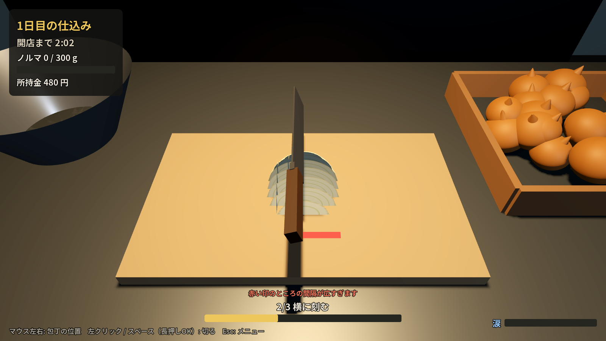
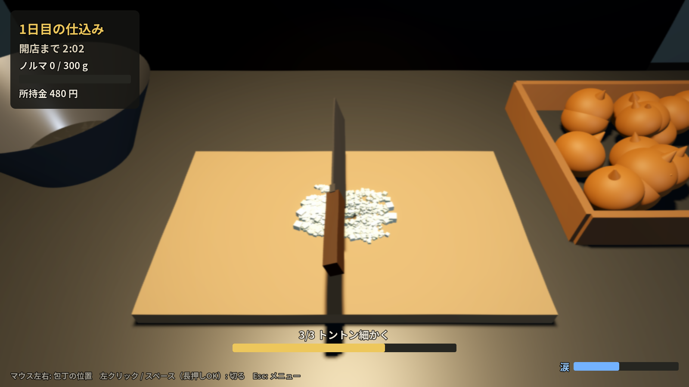

# 涙のみじん切り / Onion Tears（仮題）

洋食屋の仕込み場で、開店までにひたすら玉ねぎをみじん切りにする 3D シミュレーションゲームです。
切るほど目がしみて視界がにじむ「涙」がこのゲームの売りです。
稼いだお金で包丁やゴーグル、フードプロセッサーを買って、仕込みを効率化・自動化していきます。
最終目標は **Steam での販売** です。





## 遊び方

| 操作 | 内容 |
| --- | --- |
| マウス左右 | 包丁の位置を動かす |
| 左クリック / スペース | 包丁を下ろす（みじん切り工程は長押しでトントン連打） |
| Esc | 一時停止メニュー |

半分に切った玉ねぎ1個を、3つの工程で仕上げます。

1. **縦に切り込み**：まな板の手前に赤い印が出ている間は、切れ目の間隔が広すぎます。印が消えるまで切る。
2. **横に刻む**：玉ねぎが90°回るので、同じように刻むとサイコロ状になる。
3. **トントン細かく**：かき集めた山に包丁を連打して、かけらを細かくする。9割が十分細かくなったら完成。

- できたみじん切りはボウルへ。グラム数に応じて報酬が入ります。
- 仕込み時間（150秒）のうちにノルマのグラム数を刻めば翌日へ。未達なら同じノルマに再挑戦。
- **涙ゲージ**：切るたびにたまり、画面がにじみます。満タンになると数秒間、目が開けられず切れません。
- 仕込み終了後の「厨房道具屋」で強化を買えます。
  - **よく切れる包丁**：みじん切りで一度に刻める幅が広がる
  - **玉ねぎゴーグル**：涙がたまりにくくなる
  - **フードプロセッサー**：一定時間ごとに自動で100g刻む
  - **仕入れ先と値段交渉**：100gあたりの報酬アップ
- 進行は自動保存されます。日本語 / 英語をタイトル画面で切り替えられます。

## 開発環境の準備

1. [Godot 4.4 以降（Standard版）](https://godotengine.org/download) をダウンロード（無料・インストール不要）
2. Godot を起動 →「インポート」→ このフォルダの `project.godot` を選択
3. F5 で実行

## フォルダ構成

```
project.godot            プロジェクト設定（メインシーン、オートロード、フォント）
scenes/main.tscn         メインシーン（中身は main.gd がコードで組み立てる）
scripts/
  main.gd                仕込み場の3D空間・仕込みループ・包丁・涙・フードプロセッサー
  onion.gd               刻まれる玉ねぎ（切れ目の管理、ブロックのメッシュ生成、みじん切りの山）
  game_state.gd          セーブ/ロード、お金、アップグレード、バランス調整の数式
  ui.gd                  HUD・タイトル・仕込み終了画面＋道具屋・一時停止
  i18n.gd                日本語/英語のテキスト表
  dev_screenshot.gd      開発用：コマンドラインでスクリーンショットを撮る
shaders/
  onion.gdshader         切り口に玉ねぎの層（同心円）が見えるシェーダー
  tears.gdshader         涙で画面がゆらゆらにじむ効果
fonts/                   Noto Sans JP（SIL OFL ライセンス。Steam 販売でも同梱可）
docs/STEAM_ROADMAP.md    Steam 販売までの道のり
```

### 切るしくみ

- 半分の玉ねぎは「半楕円体」。切れ目の位置を X（縦）と Z（横）のリストで持ち、
  切れ目で区切られたブロックごとにメッシュを組み立て直しています。
- シェーダーには切る前の座標を渡していて、切り口に層の輪が正しく現れます。
- みじん切り工程では、ブロックを小さな立方体（MultiMesh）に置き換え、
  包丁が当たったかけらを 2 つに割っていきます。

### バランス調整

数値は `scripts/game_state.gd`（時間・ノルマ・報酬・アップグレード）、
`scripts/onion.gd`（切れ目の許容間隔・みじん切りの目標サイズ）、
`scripts/main.gd` 冒頭（涙のたまり方）にまとまっています。

### スクリーンショットを撮る（開発用）

```sh
godot --path . -- --shot=mince --out=/tmp/mince.png --lang=ja   # title / cut / mince / shop
```

## 次にやること

[docs/STEAM_ROADMAP.md](docs/STEAM_ROADMAP.md) に、Steam 販売までのやることリストをまとめています。
