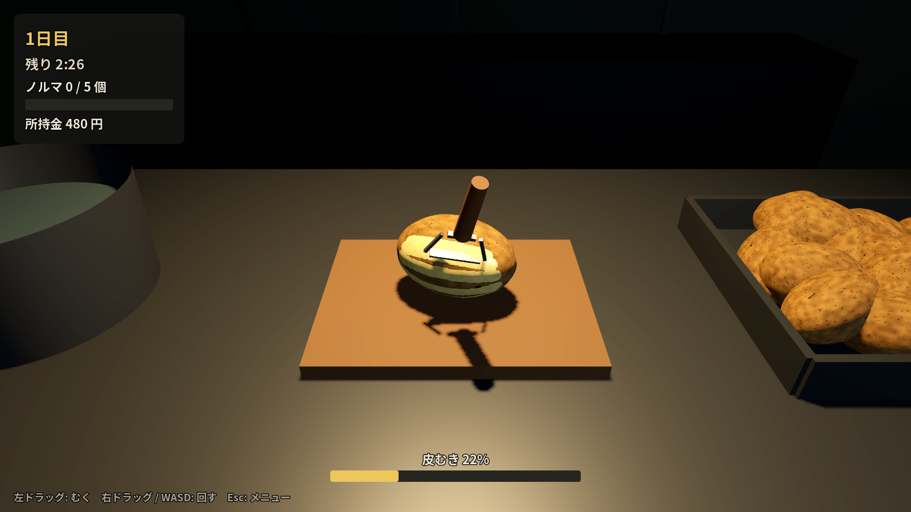
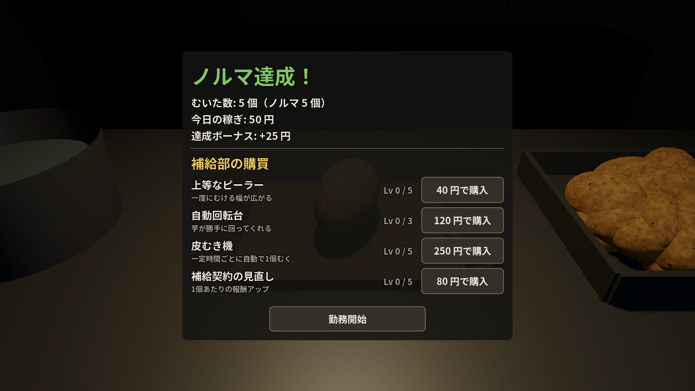

# 芋むき兵站部 / Spud Duty（仮題）

軍の食事を用意するため、ひたすらジャガイモの皮をむく 3D シミュレーションゲームです。
最初は手作業で、稼いだお金で道具や機械を買い、自動化と効率化を進めていきます。
最終目標は **Steam での販売** です。

> ⚠️ 着想元の「Potato Please」は他社の作品です。タイトル・ロゴ・画像・モデルなどは流用せず、
> このリポジトリの名前や見た目はすべてオリジナルにしてあります（「芋むき兵站部」は仮題）。




## 遊び方

| 操作 | 内容 |
| --- | --- |
| 左ドラッグ | ピーラーで皮をむく |
| 右ドラッグ / WASD | ジャガイモを回す |
| Esc | 一時停止メニュー |

1. 勤務時間（150秒）のあいだにジャガイモの皮をむく。93% むけたら完成扱いで鍋へ。
2. 1個ごとに給金が入り、ノルマを達成すると翌日に進めてボーナスももらえる。
3. 終業後の「補給部の購買」で強化を買う。
   - **上等なピーラー**: 一度にむける幅が広がる
   - **自動回転台**: 芋が勝手に回る（ピーラーを当てておくだけでむける）
   - **皮むき機**: 一定時間ごとに自動で1個むいてくれる
   - **補給契約の見直し**: 1個あたりの報酬アップ
4. 進行は自動保存されます。日本語 / 英語をタイトル画面で切り替えられます。

## 開発環境の準備

1. [Godot 4.4 以降（Standard版）](https://godotengine.org/download) をダウンロード（無料・インストール不要）
2. Godot を起動 →「インポート」→ このフォルダの `project.godot` を選択
3. F5 で実行

## フォルダ構成

```
project.godot            プロジェクト設定（メインシーン、オートロード、フォント）
scenes/main.tscn         メインシーン（中身は main.gd がコードで組み立てる）
scripts/
  main.gd                調理場の3D空間・勤務ループ・ピーラー・皮むき機
  potato.gd              皮がむけるジャガイモ（マスク画像で「むけた場所」を管理）
  game_state.gd          セーブ/ロード、お金、アップグレード、バランス調整の数式
  ui.gd                  HUD・タイトル・終業画面＋購買・一時停止
  i18n.gd                日本語/英語のテキスト表
  dev_screenshot.gd      開発用：コマンドラインでスクリーンショットを撮る
shaders/potato.gdshader  皮と中身を塗り分け、形をでこぼこにするシェーダー
fonts/                   Noto Sans JP（SIL OFL ライセンス。Steam 販売でも同梱可）
docs/STEAM_ROADMAP.md    Steam 販売までの道のり
```

### 皮むきのしくみ

- ジャガイモは球を楕円体に伸ばし、シェーダーで凸凹にしたもの。
- 表面を「経度 × 緯度」の 256×128 のマスク画像で管理し、白い部分が「むけた」場所。
- マウスのレイと楕円体の交点を数式で求め、前フレームの位置からの線に沿ってマスクを塗る。
- むけた面積は緯度ごとの面積の重みつきで数えるので、極付近を塗っても不当に進みません。

### バランス調整

数値はすべて `scripts/game_state.gd` にまとまっています
（勤務時間、ノルマの式、報酬、アップグレードの価格と効果）。

### スクリーンショットを撮る（開発用）

```sh
godot --path . -- --shot=play --out=/tmp/play.png --lang=ja   # title / play / shop
```

## 次にやること

[docs/STEAM_ROADMAP.md](docs/STEAM_ROADMAP.md) に、Steam 販売までのやることリストをまとめています。
