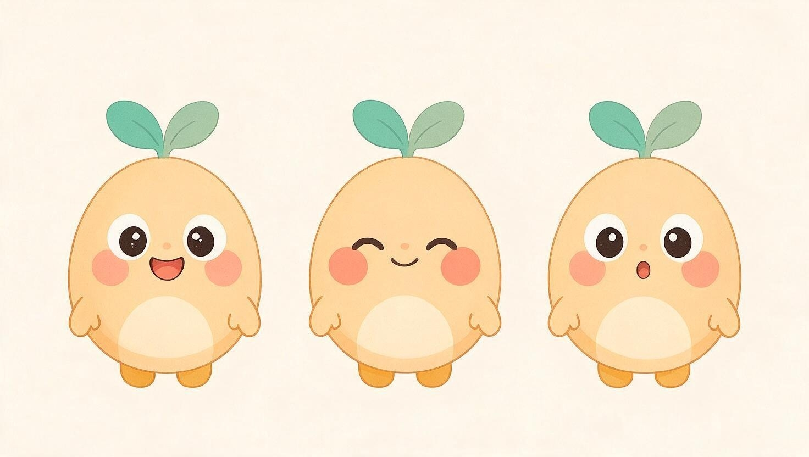
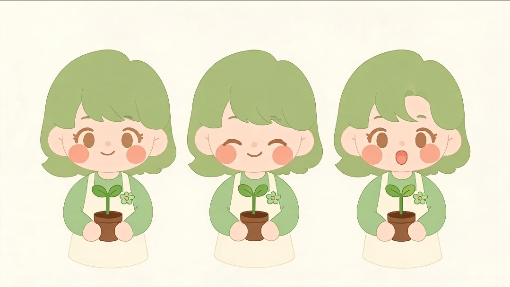

# キャラクターデザイン仕様書

チャンネル [channel-strategy.md](./channel-strategy.md) §7で定義した2キャラクターの詳細デザイン仕様。
実写は使用せず、全編2Dアニメーションで制作する([channel-strategy.md](./channel-strategy.md)参照)。

**ステータス: デザイン確定(Genspark生成)**
§5のプロンプトでGensparkにより生成し、採用したキャラクター表情シート:

| たねちゃん | みどり先生 |
|---|---|
|  |  |

丸み優先のシルエット、双葉モチーフ、カラーパレットともにブリーフ通りの仕上がりで確定。以降のサムネイル・アニメーション制作はこの表情シートを正として進める。

**方向性検討時のラフスケッチ(Artifact・参考)**: https://claude.ai/artifact/B6wsKXRmHXBB8ZHrTqq3LH
(Gensparkでの生成前に方向性をすり合わせるために作成した簡易ラフ。最終デザインは上記の生成画像を正とする)

---

## 1. たねちゃん(CHARACTER 01)

**役割**: 子供向け本編シリーズ共通のナビゲーター(全シリーズに登場)
**モチーフ**: 種・芽(チャンネル名「げんきのたね」を体現)

### 性格
げんきで、まっすぐで、ちょっとおっちょこちょい。「いっしょにやってみよう！」と誘いかけ、子供の「自分もやってみたい」という模倣意欲を引き出す。否定的な言葉は使わず、できないことも「れんしゅうちゅう」と肯定的に受け止める。

### 造形
- 頭と胴体を分けない一体型シルエット、約2頭身の丸いフォルム(種/どんぐりのような輪郭)
- 頭頂部に緑の「ふたば(双葉)」が生えており、ブランドモチーフを常時表示
- 角を一切使わず、全身を丸みのある輪郭で統一(感覚過敏の子にも見やすい設計)
- 表情は目・ほっぺ・口の3要素のみで大きく分かりやすく変化させる

### カラーパレット
| 用途 | カラー | HEX |
|---|---|---|
| からだ | クリームオレンジ | `#FFD9A0` |
| おなか(ハイライト) | ペールクリーム | `#FFEFD1` |
| ふたば(葉) | ミントグリーン | `#7DC9A7` |
| くき・葉の影 | ディープグリーン | `#5FAE8C` |
| ほっぺ | コーラルピンク | `#FFB6A0` |
| 目・線 | ダークブラウン | `#3A2E26` |
| 足 | アンバークリーム | `#EFB97F` |

### モーション・声のルール
- まばたき・呼吸のようなゆったりしたアイドルモーションを基本とし、不規則な高速の動きは使わない
- 声は高すぎない落ち着いたトーンで、はっきり・ゆっくり発話する

---

## 2. みどり先生(CHARACTER 02)

**役割**: 「ほいくしのワンポイント」保護者向けシリーズのナビゲーター
**モチーフ**: 緑・育てる手(「みどり」という名前で世界観を表現)

### 性格
落ち着いていて、決めつけず寄り添う。専門用語を避け、「現場ではこうしています」という提案ベースの語り口。声は監修者本人(保育士・発達支援員)が担当し、肩書きテロップを添えて信頼性を示す。

### 造形
- たねちゃんより落ち着いた大人のシルエット、約3〜3.5頭身
- 常に鉢植えの芽を手に持ち、「たねちゃんを見守り育てる人」であることを視覚的に表現
- 髪と衣装に「みどり」を基調色として必ず使用し、名前の由来を視覚化
- 派手な柄・複雑なアクセサリーは使わず、単色の面構成のみでデザインする

### カラーパレット
| 用途 | カラー | HEX |
|---|---|---|
| 髪(ボブ) | モスグリーン | `#6B9080` |
| カーディガン | セージグリーン | `#A9C5A0` |
| エプロン・襟 | オフクリーム | `#FFF9F2` |
| 肌 | ウォームベージュ | `#FFDFC4` |
| 胸元のリーフピン | ミントグリーン | `#7DC9A7` |
| ほっぺ | コーラルピンク | `#FFB6A0` |
| 靴 | ダークブラウン | `#6B4F3A` |

### 出演・声のルール
- 実写の顔出しは行わない。声のみ監修者本人が担当し、肩書きテロップ(例:「保育士歴12年」)を毎回統一書式で画面に表示する
- 断定表現を避け、提案ベースの落ち着いた話し方を徹底する

---

## 3. 2キャラクター共通のデザインルール

チャンネル全体のブランド一貫性と、感覚配慮設計([channel-strategy.md](./channel-strategy.md) §1・§3)を両立するための共通ルール。

- 造形はすべて丸み優先。鋭角・トゲ・複雑な模様は使わない
- 蛍光色・強いグラデーションは使わず、トーンを揃えた面の色だけで構成する
- 表情変化は目・ほっぺ・口の3要素のみで大きく分かりやすく表現する
- 動きは予測可能でゆったりしたものを基本とし、不規則な高速モーションは避ける
- たねちゃんの「ふたば」モチーフを、みどり先生の鉢植え・胸のリーフピンにも共通させ、2キャラクターの世界観のつながりを示す
- 全動画に字幕・肩書きテロップを統一書式で表示する

### チャンネル共通カラーパレット(ランディングページ・サムネイルと共通)

| 用途 | カラー | HEX |
|---|---|---|
| ブランドカラー | オレンジ | `#FF9D5C` |
| アクセント(緑) | ミントグリーン | `#7DC9A7` |
| アクセント(黄) | イエロー | `#FFD166` |
| アクセント(青) | スカイブルー | `#8FB8DE` |
| 背景 | オフホワイト | `#FFF9F2` |
| テキスト | ダークブラウン | `#3A2E26` |

サムネイル・テロップ・[ランディングページ](../landing/index.html)と同一パレットをキャラクターにも適用し、チャンネル全体で一貫したブランド認知を作る。

---

## 4. 次のステップ

- [x] Gensparkで生成した表情シート(たねちゃん・みどり先生)を確定デザインとして採用([assets/characters/](../assets/characters/))
- [ ] 確定した表情シートをもとに、アニメーション用の追加ポーズ(お辞儀・手を振る・うなずく等、各台本で使う動作)を同様のプロンプトで追加生成する
- [ ] 各シリーズの台本([scripts/](../scripts/))にある演出メモを、本仕様書のモーションルールと突き合わせて統一する
- [ ] モーションガイドライン(まばたき間隔、口パクパターン等)をこの表情シートを基準にアニメーション用ガイドとして追補する
- [ ] サムネイル・[ランディングページ](../landing/index.html)に確定デザインの画像を反映する

---

## 5. Genspark生成プロンプト案

そのままGensparkに貼り付けて使えるプロンプト例。日本語プロンプトでの生成精度が低い場合は英訳して使用する。

### たねちゃん

```
2Dフラットベクターイラスト、子供向けYouTubeキャラクターのキャラクターシート(正面向き)。
種・双葉モチーフのマスコット。頭と胴体が一体化した丸い卵型シルエット、約2頭身。
頭頂部に緑の双葉(#7DC9A7と#5FAE8C)が生えている。
体色はクリームオレンジ(#FFD9A0)、お腹に薄いハイライト(#FFEFD1)。
大きな丸い目(白目+こげ茶#3A2E26の瞳+小さなハイライト)、コーラルピンク(#FFB6A0)の丸いほっぺ、
シンプルな曲線の笑顔。小さな丸い手足、足の色はアンバークリーム(#EFB97F)。
輪郭線は最小限、鋭角なし、すべて丸みのある柔らかいフォルム。
蛍光色・複雑な模様・グラデーションは使わない。背景は無地の生成り色(#FFF9F2)またはホワイト。
表情違いを3パターン(笑顔・驚き・照れ)並べたキャラクターシート。
```

### みどり先生

```
2Dフラットベクターイラスト、子供向けYouTubeキャラクターのキャラクターシート(正面向き)。
落ち着いた保育士風の女性キャラクター、約3〜3.5頭身のデフォルメ体型。
モスグリーン(#6B9080)のショートボブヘア、セージグリーン(#A9C5A0)のカーディガン、
生成りクリーム色(#FFF9F2)のエプロン。ウォームベージュの肌(#FFDFC4)。
胸元に小さなミントグリーン(#7DC9A7)のリーフピン。
片手に鉢植えの小さな双葉(たねちゃんと同じ双葉モチーフ)を持っている。
優しい弧を描く目、コーラルピンク(#FFB6A0)の丸いほっぺ、穏やかな微笑み。
派手な柄・アクセサリーは使わず単色の面構成。輪郭線は最小限、丸みのあるシルエット。
背景は無地の生成り色(#FFF9F2)またはホワイト。
表情違いを3パターン(微笑み・うなずき・話しかけ)並べたキャラクターシート。
```

### 共通の注意点
- 実写・3Dレンダリング調は避け、必ず「フラットな2Dベクターイラスト」を明記する
- Gensparkの出力が本仕様書のカラーパレット(HEX)と大きくズレた場合は、プロンプトに色名だけでなくHEXコードを明記して再生成する
- 複数パターン生成し、[チャンネル共通デザインルール](#3-2キャラクター共通のデザインルール)(丸み優先・蛍光色NG・派手な模様NG)に最も合致するものを選ぶ
